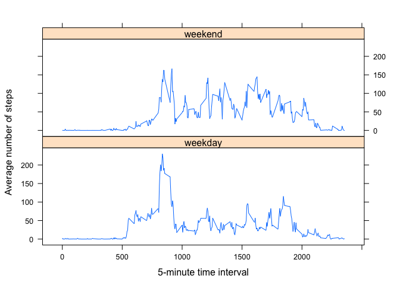

# Reproducible Research: Peer Assessment 1


## Loading and preprocessing the data
In this section, we assume the `activity.zip` file is present in working directory, and the data are being directly loaded in a `data.frame` structure called `df`.

```r
file <- unzip("activity.zip")
df <- read.csv(file, header=TRUE)
str(df)
```

```
## 'data.frame':	17568 obs. of  3 variables:
##  $ steps   : int  NA NA NA NA NA NA NA NA NA NA ...
##  $ date    : Factor w/ 61 levels "2012-10-01","2012-10-02",..: 1 1 1 1 1 1 1 1 1 1 ...
##  $ interval: int  0 5 10 15 20 25 30 35 40 45 ...
```
We transform the `df$date` column into a `Date` format object for later date manipulation like `weekdays()`.

```r
df$date <- as.Date(df$date, '%Y-%m-%d')
str(df)
```

```
## 'data.frame':	17568 obs. of  3 variables:
##  $ steps   : int  NA NA NA NA NA NA NA NA NA NA ...
##  $ date    : Date, format: "2012-10-01" "2012-10-01" ...
##  $ interval: int  0 5 10 15 20 25 30 35 40 45 ...
```
Let's take a look at the data distributio and NA's by calling the `summary()` function.

```r
summary(df)
```

```
##      steps           date               interval   
##  Min.   :  0    Min.   :2012-10-01   Min.   :   0  
##  1st Qu.:  0    1st Qu.:2012-10-16   1st Qu.: 589  
##  Median :  0    Median :2012-10-31   Median :1178  
##  Mean   : 37    Mean   :2012-10-31   Mean   :1178  
##  3rd Qu.: 12    3rd Qu.:2012-11-15   3rd Qu.:1766  
##  Max.   :806    Max.   :2012-11-30   Max.   :2355  
##  NA's   :2304
```
The output of the `summary()` funtion shows that missing values are present (NA's) in the data set and should be removed or take into account during the processing of the data.

## What is mean total number of steps taken per day?
In this section, we ignore the missing values NA's.  
The first step to asnwer the question is to create a daily aggregation of the number of steps (`df$steps`) by adding (`FUN=sum`) all the steps from each time interval by each day (`df$date`).

```r
daily <- aggregate(steps ~ date, data=df, FUN=sum)
hist(daily$steps, main='Total number of steps each day', xlab='Steps')
```

 

The mean and median values for the total number of steps taken per day are respectivelly **10766.19** and **10765**.

## What is the average daily activity pattern?
To asnwer this question, we need to create an aggregation that avergae the number of steps per 5-minute time interval. 


```r
inter <- aggregate(steps ~ interval, data=df, FUN=mean)
plot(inter, type="l", main='Average daily activity pattern', xlab='5-minute time interval', ylab='Average number of steps')
```

 

The 5-minute interval that contains the maximum value of steps on average accross all day is **835** for a value of **206.17**.

## Imputing missing values
In the first section, the number of missing values (`NA`) was already reported in the output of `summary()`.  
We can compute the number of missing values with:

```r
sum(is.na(df))
```

```
## [1] 2304
```
How many days have no recorded steps value but only `NA`? The number of time intervals for a day is equal to 24*12=288. Any day with 288 `NA` observations is a day with no steps registered and so we cannot compute any average of median for that day and fill in the data with.

```r
nacount <- setNames(aggregate(is.na(df$steps) ~ date, data=df, FUN=sum), c("date","NA Count"))
nrow(nacount[nacount$"NA Count"==288,])
```

```
## [1] 8
```
We can see that there are **8** days with no step recorded at all.

In this case, we will use the *average daily activity pattern* that we just computed in the previous section to replace the `NA` values of each time interval.  
First we create a new data set `df2` and apply the strategy and finally check there is no more `NA`.


```r
df2 <- df
df2$steps[is.na(df2$steps)] <- inter$steps[match(df2$interval,inter$interval)][is.na(df2$steps)]
sum(is.na(df2))
```

```
## [1] 0
```
We now apply the same analysis than before.

```r
new_daily <- aggregate(steps ~ date, data=df2, FUN=sum)
hist(new_daily$steps, main='Total number of steps each day', xlab='Steps')
```

 

The mean and median values for the total number of steps taken per day are respectivelly **10766.19** and **10766.19**. The differences are really minors.  
For the rest of the study, we will use the new data set called `df2`.

## Are there differences in activity patterns between weekdays and weekends?
First, we add a new factor variable `daytype` to our existing `df2` dataframe and define the weekend days as "Saturday" and "Sunday" and the rest as weekday.

```r
df2$daytype <- factor(ifelse(weekdays(df2$date) %in% c("Sunday", "Saturday"), "weekend", "weekday"))
str(df2)
```

```
## 'data.frame':	17568 obs. of  4 variables:
##  $ steps   : num  1.717 0.3396 0.1321 0.1509 0.0755 ...
##  $ date    : Date, format: "2012-10-01" "2012-10-01" ...
##  $ interval: int  0 5 10 15 20 25 30 35 40 45 ...
##  $ daytype : Factor w/ 2 levels "weekday","weekend": 1 1 1 1 1 1 1 1 1 1 ...
```
Then we create a new aggregation on interval and daytype

```r
inter_daytype <- aggregate(steps ~ interval + daytype, data=df2, FUN=mean)
```
And finally we plot the weekend and weekday average number of steps per 5-minute time intervals.

```r
library(lattice)
xyplot(steps ~ interval | daytype, data = inter_daytype, layout = c(1,2), type="l", xlab='5-minute time interval', ylab='Average number of steps')
```

 

We can see a difference of patterns accross the type of days and by looking at the `mean` and `median` per daytype.

```r
tapply(inter_daytype$steps, inter_daytype$daytype, mean)
```

```
## weekday weekend 
##      36      42
```

```r
tapply(inter_daytype$steps, inter_daytype$daytype, median)
```

```
## weekday weekend 
##      26      32
```
This concludes the Peer Assessment 1.
